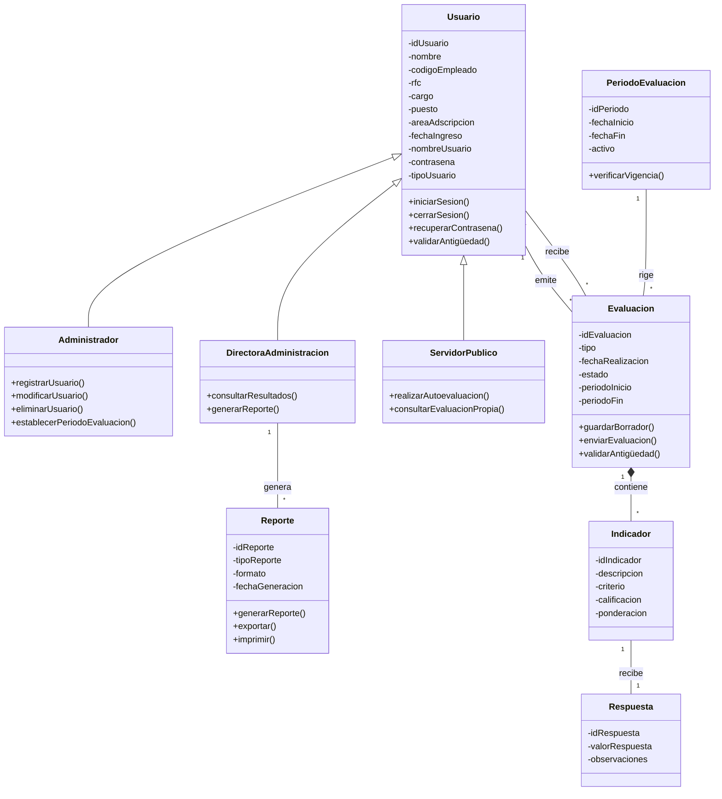

## Diagrama de clases

```mermaid
classDiagram
    class Usuario {
        -idUsuario
        -nombre
        -codigoEmpleado
        -rfc
        -cargo
        -puesto
        -areaAdscripcion
        -fechaIngreso
        -nombreUsuario
        -contrasena
        -tipoUsuario
        +iniciarSesion()
        +cerrarSesion()
        +recuperarContrasena()
        +validarAntigüedad()
    }
    class Administrador {
        +registrarUsuario()
        +modificarUsuario()
        +eliminarUsuario()
        +establecerPeriodoEvaluacion()
    }
    class DirectoraAdministracion {
        +consultarResultados()
        +generarReporte()
    }
    class ServidorPublico {
        +realizarAutoevaluacion()
        +consultarEvaluacionPropia()
    }
    class Evaluacion {
        -idEvaluacion
        -tipo
        -fechaRealizacion
        -estado
        -periodoInicio
        -periodoFin
        +guardarBorrador()
        +enviarEvaluacion()
        +validarAntigüedad()
    }
    class PeriodoEvaluacion {
        -idPeriodo
        -fechaInicio
        -fechaFin
        -activo
        +verificarVigencia()
    }
    class Indicador {
        -idIndicador
        -descripcion
        -criterio
        -calificacion
        -ponderacion
    }
    class Respuesta {
        -idRespuesta
        -valorRespuesta
        -observaciones
    }
    class Reporte {
        -idReporte
        -tipoReporte
        -formato
        -fechaGeneracion
        +generarReporte()
        +exportar()
        +imprimir()
    }

    Usuario <|-- Administrador
    Usuario <|-- DirectoraAdministracion
    Usuario <|-- ServidorPublico
    Usuario "1" -- "*" Evaluacion : emite
    Usuario "1" -- "*" Evaluacion : recibe
    PeriodoEvaluacion "1" -- "*" Evaluacion : rige
    Evaluacion "1" *-- "*" Indicador : contiene
    Indicador "1" -- "1" Respuesta : recibe
    DirectoraAdministracion "1" -- "*" Reporte : genera
```
